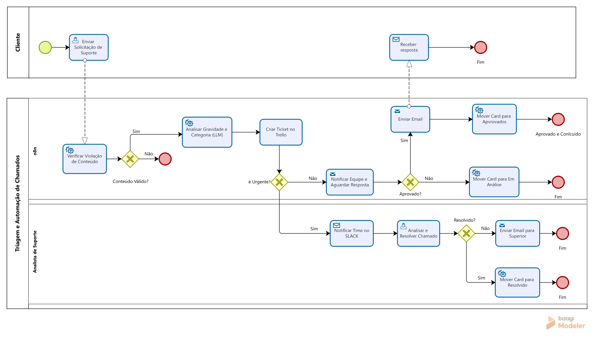
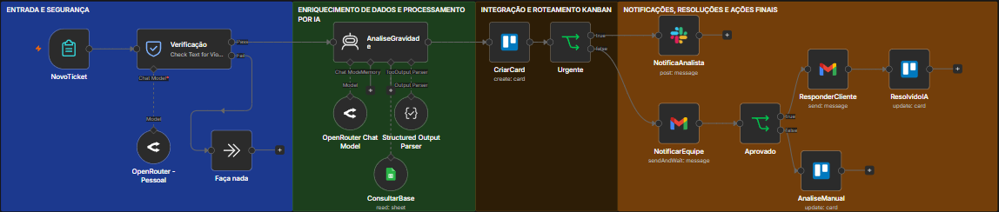

# 🚀 Triagem, Gestão e Escalamento Automatizado de Chamados (n8n + LLM + BPMN)

Este repositório contém a modelagem de processos e a implementação técnica de uma solução inteligente de triagem, roteamento e suporte automatizado para empresas SaaS. 

A arquitetura combina **modelagem formal em BPMN 2.0**, orquestração de fluxos via **n8n**, inteligência artificial multimodelo com **Guardrails de Segurança (LLM via OpenRouter)** e integração multicanal (**Trello, Slack, Gmail e Google Sheets**).

---

## 📐 Modelagem do Processo (BPMN 2.0)

O fluxo foi desenhado no **Bizagi Process Modeler**, separando claramente as responsabilidades em três raias operacionais (*Swimlanes*):

1. **Cliente:** Envio da solicitação e recebimento das notificações/soluções.
2. **n8n (Automação & IA):** Validação de segurança (Guardrails), classificação semântica com LLM, enriquecimento de dados e roteamento condicional.
3. **Analista de Suporte (Atendimento Humano):** Atuação em chamados urgentes/críticos e gestão do fluxo de escalamento para supervisão.



> 💡 **Ficheiro Editável:** [Descarregar projeto no Bizagi (.bpm)](diagrams/TriagemAutomacaoChamadosv3.bpm)

---

## ⚙️ Arquitetura da Solução e Fluxo de Execução



Abaixo está o detalhamento de cada nó configurado no n8n e sua função operacional dentro do fluxo:

---

### 1. Entrada e Segurança
* **`NovoTicket` (Webhook):** Ponto de entrada do sistema. Recebe o payload com os dados do chamado enviado pelo cliente (`data`, `nome`, `email`, `empresa`, `assunto`,`mensagem`).
* **`Verificação` (Guardrail LLM - OpenRouter / Gemini 3.1 Pro):** Avalia a mensagem do cliente em duas camadas de proteção: [Verificação](docs/prompt-guardrails.md)
  * **Jailbreak Detection:** Identifica tentativas de injeção de prompt ou manipulação do modelo.
  * **Topical Alignment:** Garante que o assunto pertença estritamente ao escopo de suporte do SaaS.
* **`Faça nada` (No Operation):** Caso a verificação falhe (`Fail`), o fluxo desvia para este nó e encerra a execução com segurança.

---

### 2. Enriquecimento de Dados & Processamento por IA
* **`ConsultarBase` (Google Sheets):** Realiza o *Data Enrichment* buscando o e-mail do cliente na planilha de cadastro para injetar o tipo de plano (`Enterprise`, `Pro`, `Basic`) e validar se o cliente é existente.
* **`AnaliseGravidade` (Agente de IA / Gemini 1.5 Pro):** Nó principal de inteligência artificial que recebe os dados enriquecidos e a mensagem do cliente. Analisa a gravidade, determina a categoria e gera a solução técnica direta.
* **`Structured Output Parser`:** Sub-nó acoplado ao agente para forçar uma resposta estritamente em JSONSchema com os atributos: `categoria`, `prioridade`, `equipe`, `resumo`, `impacto`, `tem_solucao` e `resposta_cliente_html`.

---

### 3. Integração e Roteamento Kanban
* **`CriarCard` (Trello):** Cria um novo card no quadro Kanban de suporte preenchendo o resumo, impacto, dados do cliente e aplicando etiquetas de categoria/prioridade.
* **`Urgente` (If / Gateway):** Avalia se a prioridade calculada pela IA é urgente/crítica:
  * **Caminho True (Urgente):** Direciona para o alerta imediato.
  * **Caminho False (Padrão):** Envia para a régua regular de atendimento.

---

### 4. Notificações, Resoluções e Ações Finais
* **`NotificaAnalista` (Slack):** Dispara notificação instantânea no canal de suporte crítico com o link do card no Trello para atendimento humano imediato.
* **`NotificarEquipe` (Gmail/ Wait / Conditional):** Aguarda a validação do fluxo normal de atendimento.
* **`Aprovado` (If / Gateway):** Avalia o status da aprovação do chamado:
  * **Caminho True:** Executa o nó **`ResponderCliente`** (Gmail) enviando a solução em HTML para o cliente e move o card no Trello pelo nó **`ResolvidoIA`**.
  * **Caminho False:** Move o card para auditoria/ajustes via nó **`AnaliseManual`**.

---

## 🛠️ Tecnologias e Ferramentas

- **Modelagem de Processos:** Bizagi Process Modeler (BPMN 2.0)
- **Orquestração:** n8n
- **Inteligência Artificial:** Gemini 3.1 Pro via OpenRouter (Guardrails + Agent + Structured Output)
- **Integrações:** Trello (Kanban), Slack (Alertas), Gmail/SMTP (Comunicação) e Google Sheets (CRM/Base)

---

## 📚 Documentação Técnica Aprofundada

Para examinar os detalhes de implementação, prompts e configurações dos nós, aceda aos documentos da pasta `/docs`:

* [🛡️ **01. Guardrails e Verificação de Segurança**](docs/prompt-guardrails.md) — Prompts de Jailbreak, Topical Alignment e limites de modelo.
* [🧠 **02. Agente de IA e Output Parser**](docs/AgentesIA-LLM.md) — System prompt, injeção de contexto e JSON Schema.
* [🔌 **03. Integrações e Gateways**](docs/Integracoes-e-acoes.md) — Configuração do Trello, Slack, Gmail, Google Sheets e regras de negócio dos Gateways.

---

## 📥 Estrutura do Repositório

```text
📁 projeto-triagem-chamados
├── 📄 README.md
├── 📁 assets/                     <-- Imagens usadas no README (BPMN, screenshots)
│   └── 🖼️ TriagemAutomacaoChamadosv3.png
├── 📁 diagrams/                   <-- Ficheiros editáveis de modelagem
│   └── 📄 TriagemAutomacaoChamadosv3.bpm
├── 📁 n8n-flows/                  <-- Código e exportações do n8n
│   └── 📄 TriagemAutomacaoChamadosv3.json
└── 📁 docs/                       <-- Documentação técnica detalhada
    ├── 📄 prompt-guardrails.md
    ├── 📄 AgentesIA-LLM.md
    └── 📄 Integracoes-e-acoes.md
